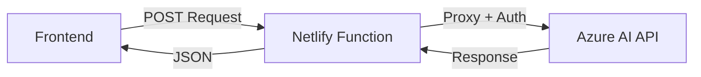

## Overview

This portfolio integrates Azure AI's chat completion API to power an intelligent chat assistant. The integration uses Azure's serverless inference endpoint through a Netlify Function proxy.

## Azure AI Setup

<Steps>
  <Step title="Create Azure Account">
    Sign up for a Microsoft Azure account at [azure.microsoft.com](https://azure.microsoft.com)

    <Info>
      Azure offers free credits for new users, which is perfect for testing and small-scale deployments.
    </Info>
  </Step>

  <Step title="Access Azure AI Services">
    Navigate to Azure AI Studio:
    
    1. Go to [Azure AI Studio](https://ai.azure.com)
    2. Sign in with your Azure account
    3. Create a new project or select an existing one
  </Step>

  <Step title="Deploy a Model">
    Deploy a chat completion model:
    
    1. Navigate to **Deployments** in your Azure AI project
    2. Click **Create new deployment**
    3. Select a model (e.g., `gpt-4o-mini` for cost-effective inference)
    4. Configure deployment settings
    5. Deploy the model
  </Step>

  <Step title="Get API Credentials">
    Retrieve your API token:
    
    1. Go to your deployment details
    2. Copy the **API Key** (this is your `API_TOKEN`)
    3. Note the **Endpoint URL** (should be `https://models.inference.ai.azure.com`)
  </Step>
</Steps>

## API Endpoint

The integration uses Azure's serverless inference endpoint:

```
https://models.inference.ai.azure.com/chat/completions
```

<Note>
  This is a unified endpoint that routes requests to your deployed models based on the model name in your request.
</Note>

## Integration Architecture



The Netlify Function acts as a secure proxy:

1. **Frontend** sends chat requests to `/.netlify/functions/chat`
2. **Netlify Function** adds authentication and forwards to Azure AI
3. **Azure AI** processes the request and returns completions
4. **Netlify Function** proxies the response back to the frontend

## Configuration

### Environment Variables

Set your Azure AI API token in Netlify:

<CodeGroup>
```bash Netlify Dashboard
# Navigate to:
# Site Settings > Environment Variables

API_TOKEN=your_azure_ai_api_token_here
```

```bash Local Development (.env)
# Create .env file in project root
API_TOKEN=your_azure_ai_api_token_here
```
</CodeGroup>

<Warning>
  Never commit your `.env` file or API tokens to version control. Add `.env` to your `.gitignore` file.
</Warning>

### Function Implementation

The Netlify Function handles authentication automatically:

```typescript netlify/functions/chat.ts
const response = await fetch('https://models.inference.ai.azure.com/chat/completions', {
  method: 'POST',
  headers: {
    'Content-Type': 'application/json',
    'Authorization': `Bearer ${process.env.API_TOKEN}`
  },
  body: event.body
});
```

See the full implementation in [serverless-functions.mdx](/deployment/serverless-functions).

## Request Format

Send requests following the OpenAI chat completion format:

```json
{
  "messages": [
    {
      "role": "system",
      "content": "You are a helpful assistant."
    },
    {
      "role": "user",
      "content": "Hello, how are you?"
    }
  ],
  "model": "gpt-4o-mini",
  "max_tokens": 1000,
  "temperature": 0.7
}
```

### Request Parameters

| Parameter | Type | Required | Description |
|-----------|------|----------|-------------|
| `messages` | Array | Yes | Array of message objects with `role` and `content` |
| `model` | String | Yes | Model identifier (e.g., `gpt-4o-mini`) |
| `max_tokens` | Number | No | Maximum tokens in response (default: 1000) |
| `temperature` | Number | No | Randomness level 0-2 (default: 0.7) |

## Response Format

Azure AI returns responses in OpenAI-compatible format:

```json
{
  "id": "chatcmpl-abc123",
  "object": "chat.completion",
  "created": 1677652288,
  "model": "gpt-4o-mini",
  "choices": [
    {
      "index": 0,
      "message": {
        "role": "assistant",
        "content": "Hello! I'm doing well, thank you for asking."
      },
      "finish_reason": "stop"
    }
  ],
  "usage": {
    "prompt_tokens": 20,
    "completion_tokens": 15,
    "total_tokens": 35
  }
}
```

## Frontend Integration Example

<CodeGroup>
```typescript React Hook
import { useState } from 'react';

function useChat() {
  const [messages, setMessages] = useState([]);
  const [loading, setLoading] = useState(false);

  const sendMessage = async (content: string) => {
    setLoading(true);
    
    try {
      const response = await fetch('/.netlify/functions/chat', {
        method: 'POST',
        headers: { 'Content-Type': 'application/json' },
        body: JSON.stringify({
          messages: [
            ...messages,
            { role: 'user', content }
          ],
          model: 'gpt-4o-mini',
          max_tokens: 1000
        })
      });

      const data = await response.json();
      const assistantMessage = data.choices[0].message;
      
      setMessages([...messages, 
        { role: 'user', content },
        assistantMessage
      ]);
    } catch (error) {
      console.error('Chat error:', error);
    } finally {
      setLoading(false);
    }
  };

  return { messages, sendMessage, loading };
}
```

```typescript Vue Composable
import { ref } from 'vue';

export function useChat() {
  const messages = ref([]);
  const loading = ref(false);

  const sendMessage = async (content: string) => {
    loading.value = true;
    
    try {
      const response = await fetch('/.netlify/functions/chat', {
        method: 'POST',
        headers: { 'Content-Type': 'application/json' },
        body: JSON.stringify({
          messages: [
            ...messages.value,
            { role: 'user', content }
          ],
          model: 'gpt-4o-mini',
          max_tokens: 1000
        })
      });

      const data = await response.json();
      const assistantMessage = data.choices[0].message;
      
      messages.value = [
        ...messages.value,
        { role: 'user', content },
        assistantMessage
      ];
    } catch (error) {
      console.error('Chat error:', error);
    } finally {
      loading.value = false;
    }
  };

  return { messages, sendMessage, loading };
}
```
</CodeGroup>

## Available Models

Azure AI supports various models. Popular options:

- **gpt-4o-mini**: Cost-effective, fast responses, good for general chat
- **gpt-4o**: More capable, better for complex tasks
- **gpt-4-turbo**: Advanced reasoning and longer context

<Info>
  Check the [Azure AI Model Catalog](https://ai.azure.com/explore/models) for the latest available models and pricing.
</Info>

## Cost Optimization

<Steps>
  <Step title="Choose the Right Model">
    Use `gpt-4o-mini` for general chat interactions to minimize costs while maintaining quality.
  </Step>

  <Step title="Limit Token Usage">
    Set reasonable `max_tokens` values to prevent excessive token consumption:
    
    ```typescript
    max_tokens: 1000  // Adjust based on your use case
    ```
  </Step>

  <Step title="Monitor Usage">
    Track your API usage in the Azure portal to avoid unexpected charges.
  </Step>

  <Step title="Implement Rate Limiting">
    Add rate limiting on the frontend or in the Netlify Function to prevent abuse.
  </Step>
</Steps>

## Troubleshooting

### Authentication Errors

If you receive 401 Unauthorized errors:

1. Verify your `API_TOKEN` environment variable is set correctly in Netlify
2. Check that the token hasn't expired
3. Ensure you're using the correct token (not the endpoint URL)

### Model Not Found

If you get model not found errors:

1. Verify the model is deployed in your Azure AI project
2. Check the model name matches exactly
3. Ensure your API token has access to the model

### Timeout Issues

If requests timeout:

1. Reduce `max_tokens` to speed up generation
2. Check Azure AI service status
3. Consider upgrading Netlify plan for longer function timeouts

<Warning>
  Netlify Functions have a 10-second timeout on free plans. Large responses may timeout.
</Warning>

## Security Best Practices

- **Never expose API tokens** in frontend code or version control
- **Use environment variables** for all sensitive credentials
- **Implement rate limiting** to prevent abuse and unexpected costs
- **Restrict CORS** to your specific domain in production
- **Monitor API usage** regularly through Azure portal
- **Rotate tokens** periodically for enhanced security
